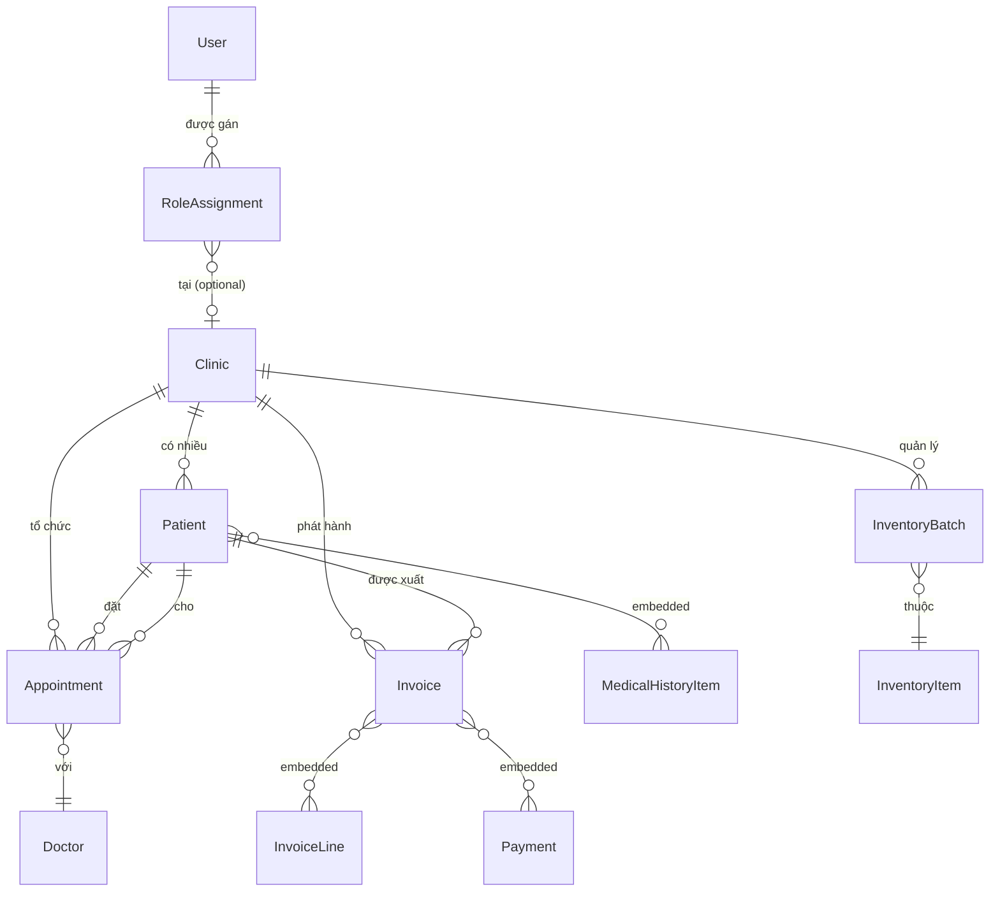

# Đặc tả Hệ thống — Dental Management System

> **Phiên bản tài liệu:** 1.0  
> **Ngày phân tích:** 2026-09-14  
> **Người phân tích:** Technical Lead / System Analyst  
> **Trạng thái:** Reverse-engineered từ source code hiện tại

---

## I. Tổng quan dự án (Project Overview)

### 1.1 Mục đích chính của hệ thống

**Dental Management System** là một nền tảng quản lý phòng khám nha khoa tư nhân toàn diện (multi-clinic). Hệ thống cho phép:

- Quản lý hồ sơ **bệnh nhân** (Patient) và tiền sử bệnh lý có cấu trúc.
- Quản lý **lịch hẹn khám** (Appointment) theo bác sĩ, phòng khám, phát hiện xung đột lịch.
- Lập và theo dõi **phác đồ điều trị** (Treatment Plan) dài hạn.
- Quản lý **hóa đơn & thanh toán** (Billing/Invoice) với hỗ trợ thanh toán nhiều đợt (partial payment).
- Quản lý **tồn kho vật tư y tế** (Inventory) theo lô hàng với chiến lược FEFO *(First Expired, First Out)*.
- Kê **đơn thuốc** (Prescription) điện tử.
- Xử lý **yêu cầu bảo hiểm** (Insurance Claim).
- Ghi nhật ký **kiểm toán** (Audit Log) đầy đủ cho mọi hành động quan trọng.
- Quản lý **phân quyền** (RBAC) theo phòng khám.

### 1.2 Công nghệ sử dụng

| Tầng | Công nghệ | Chi tiết |
|---|---|---|
| **Backend Runtime** | .NET 10 | ASP.NET Core Minimal API |
| **Backend Language** | C# | Nullable reference types, implicit usings |
| **Database** | MongoDB 6.0 | Document database, multi-collection |
| **MongoDB Driver** | MongoDB.Driver 3.11.2 | Official .NET driver |
| **Container** | Docker / Docker Compose | MongoDB chạy qua `docker-compose.yml` |
| **Frontend Framework** | Next.js (App Router) | React, TypeScript |
| **Frontend Language** | TypeScript | Node.js ≥ 20.9.0 |
| **Frontend HTTP** | Native Fetch API | `ApiClient` wrapper tự viết |
| **CSS** | PostCSS + Tailwind CSS | (postcss.config.mjs) |
| **File Storage** | Chưa cấu hình *(placeholder)* | Sẵn sàng cho GridFS / AWS S3 / Azure Blob |
| **Caching** | *(Chưa có)* | — |
| **Auth** | *(Chưa kích hoạt)* | Code đã chuẩn bị skeleton, đang bị comment |
| **Reference Schema** | PostgreSQL DDL | `databaseshema.sql` — dùng làm mô hình tham chiếu thiết kế |

> [!NOTE]
> `databaseshema.sql` là tài liệu thiết kế nghiệp vụ bằng PostgreSQL DDL (34 bảng, 11 enum), **không** phải schema thực thi. Database thực tế là **MongoDB**, được triển khai qua các `Document` class và `Collection` trong code C#.

---

## II. Kiến trúc hệ thống & Cấu trúc thư mục (Architecture & Folder Structure)

### 2.1 Pattern kiến trúc

Hệ thống áp dụng **Clean Architecture** (còn gọi là Onion Architecture) được tổ chức thành 4 layer riêng biệt, tuân thủ **Dependency Rule** — dependency chỉ được trỏ từ ngoài vào trong:

```
┌─────────────────────────────────────────┐
│          DentalManagement.Api           │  ← Presentation Layer (Minimal API)
│  (Extensions, Middleware, Contracts)    │
└───────────────────┬─────────────────────┘
                    │ phụ thuộc vào
┌───────────────────▼─────────────────────┐
│      DentalManagement.Infrastructure    │  ← Infrastructure Layer
│  (MongoDB, FileStorage, Transactions)   │
└───────────────────┬─────────────────────┘
                    │ phụ thuộc vào
┌───────────────────▼─────────────────────┐
│       DentalManagement.Application      │  ← Application Layer (Use Cases)
│  (Commands, Queries, Abstractions)      │
└───────────────────┬─────────────────────┘
                    │ phụ thuộc vào
┌───────────────────▼─────────────────────┐
│         DentalManagement.Domain         │  ← Domain Layer (Core Business)
│   (Entities, Value Objects, Enums)      │
└─────────────────────────────────────────┘
```

Ngoài ra, code áp dụng thêm:
- **CQRS Pattern** (nhẹ, không dùng MediatR): `ICommandHandler<TCommand, TResult>` và `IQueryHandler<TQuery, TResult>` tự viết.
- **Result Pattern**: Class `Result<T>` thay thế việc ném exception cho business logic failures.
- **Domain Events**: `AggregateRoot` có danh sách `_domainEvents` — cơ sở hạ tầng cho Event-Driven patterns.
- **Repository Pattern**: Abstractions nằm ở Application layer, implementations ở Infrastructure layer.

### 2.2 Cấu trúc thư mục chi tiết

```
WEB/
├── docker-compose.yml              # Khởi động MongoDB local (port 27017)
├── databaseshema.sql               # PostgreSQL DDL — tài liệu tham chiếu thiết kế nghiệp vụ
├── DentalManagement.sln            # Solution file .NET
│
├── src/
│   ├── DentalManagement.Api/                   # [PRESENTATION] Minimal API host
│   │   ├── Program.cs                          # Entry point, composition root
│   │   ├── Extensions/
│   │   │   ├── ServiceCollectionExtensions.cs  # Đăng ký DI, CORS policy
│   │   │   ├── ApplicationBuilderExtensions.cs # Pipeline: Exception handler, CORS, HTTPS
│   │   │   └── EndpointRouteBuilderExtensions.cs # Khai báo routes (/health, /api/v1/...)
│   │   ├── Contracts/
│   │   │   └── ApiResponse.cs                  # Wrapper response: ApiResponse<T>, PagedResponse<T>
│   │   └── Middleware/
│   │       └── ApiExceptionHandler.cs          # Placeholder cho exception mapping
│   │
│   ├── DentalManagement.Application/           # [USE CASES] Business logic điều phối
│   │   ├── Common/
│   │   │   ├── ICommandHandler.cs              # Interface command handler (write)
│   │   │   ├── IQueryHandler.cs                # Interface query handler (read)
│   │   │   └── PagedQuery.cs                   # Paging helper (max 100 items/page)
│   │   ├── Abstractions/
│   │   │   ├── Persistence/                    # Repository interfaces (IPatientRepository, ...)
│   │   │   └── Services/                       # Service interfaces (IClock, ICurrentUser, IFileStorage)
│   │   ├── Appointments/CreateAppointment/     # Use case: Tạo lịch hẹn
│   │   ├── Patients/CreatePatient/             # Use case: Tạo bệnh nhân (có Handler đầy đủ)
│   │   └── Billing/RegisterPayment/            # Use case: Ghi nhận thanh toán
│   │
│   ├── DentalManagement.Domain/                # [DOMAIN] Core business entities
│   │   ├── Common/                             # Base classes: Entity, AggregateRoot, AuditableEntity, Result
│   │   ├── Appointments/                       # Aggregate: Appointment + enum AppointmentStatus
│   │   ├── Patients/                           # Aggregate: Patient + record MedicalHistoryItem
│   │   ├── Billing/                            # Aggregate: Invoice + InvoiceLine + Payment
│   │   ├── Inventory/                          # Entity: InventoryBatch
│   │   ├── Clinics/                            # Entity: Clinic
│   │   ├── Catalog/                            # Record: ServiceCatalogItem
│   │   ├── Identity/                           # Record: RoleAssignment
│   │   ├── Treatments/                         # Enum: TreatmentPlanStatus
│   │   ├── Prescriptions/                      # Enum: PrescriptionStatus
│   │   ├── Insurance/                          # Enum: InsuranceClaimStatus
│   │   └── Auditing/                           # Enum: AuditAction
│   │
│   └── DentalManagement.Infrastructure/        # [INFRA] Triển khai kỹ thuật cụ thể
│       ├── Persistence/
│       │   ├── MongoDatabaseContext.cs         # Gateway đến các MongoDB collection
│       │   ├── MongoDbOptions.cs               # Config binding (ConnectionString, DatabaseName)
│       │   ├── CollectionNames.cs              # Hằng số tên collection (17 collections)
│       │   ├── MongoSessionAccessor.cs         # Truyền session qua AsyncLocal (transaction-aware)
│       │   ├── MongoSerializationConfiguration.cs # UUID subtype 4 (chuẩn BSON)
│       │   ├── Documents/                      # DTO mapping MongoDB ↔ Domain
│       │   ├── Mappings/                       # Mapper: Domain ↔ Document
│       │   ├── Repositories/                   # Concrete repos: MongoPatientRepository, MongoAppointmentRepository
│       │   └── Indexes/                        # Tạo index khi khởi động app (Hosted Service)
│       ├── Storage/
│       │   └── NotConfiguredFileStorage.cs     # Placeholder, throw NotSupportedException
│       ├── Transactions/
│       │   └── MongoTransactionRunner.cs       # MongoDB multi-document ACID transaction
│       └── DependencyInjection/
│           └── ServiceCollectionExtensions.cs  # Wiring toàn bộ Infrastructure vào DI container
│
├── frontend/                                   # [FRONTEND] Next.js App Router
│   └── src/
│       ├── app/
│       │   ├── (auth)/                         # Route group: Login, Register
│       │   └── (dashboard)/                    # Route group: Toàn bộ giao diện chính
│       │       ├── appointments/               # Trang quản lý lịch hẹn
│       │       ├── patients/                   # Trang quản lý bệnh nhân
│       │       ├── invoices/                   # Trang hóa đơn
│       │       ├── billing/                    # Trang thanh toán
│       │       ├── inventory/                  # Trang tồn kho
│       │       ├── prescriptions/              # Trang đơn thuốc
│       │       ├── treatment-plans/            # Trang phác đồ điều trị
│       │       ├── insurance/                  # Trang bảo hiểm
│       │       └── settings/                   # Trang cài đặt
│       ├── features/                           # UI components theo domain
│       ├── services/                           # HTTP service layer (apiClient wrappers)
│       ├── types/                              # TypeScript type definitions
│       └── lib/
│           ├── api-client.ts                   # Fetch-based HTTP client với error handling
│           └── env.ts                          # Environment variables
│
└── tests/
    ├── DentalManagement.Domain.Tests/          # Unit tests cho Domain layer
    ├── DentalManagement.Application.Tests/     # Unit tests cho Application layer
    ├── DentalManagement.Infrastructure.Tests/  # Integration tests Infrastructure
    └── DentalManagement.Api.Tests/             # Integration/E2E tests API
```

---

## III. Cấu trúc Dữ liệu (Data Models / Database Schema)

### 3.1 Hierarchy của Domain Base Classes

```
Entity (Id: Guid)
  └── AggregateRoot (+ DomainEvents: List<IDomainEvent>)
        └── AuditableEntity (+ CreatedAt, UpdatedAt, Touch())
```

> [!IMPORTANT]
> Tất cả các Aggregate đều kế thừa `AuditableEntity`, nghĩa là tự động có audit timestamps và khả năng phát Domain Events.

### 3.2 Các Entity / Aggregate cốt lõi trong Domain Layer

#### 🦷 Patient (Bệnh nhân)
| Thuộc tính | Kiểu | Mô tả |
|---|---|---|
| `Id` | `Guid` | Primary key |
| `ClinicId` | `Guid` | FK → Clinic (multi-clinic support) |
| `PatientCode` | `string?` | Mã bệnh nhân (unique per clinic) |
| `FullName` | `string` | Họ tên (required) |
| `DateOfBirth` | `DateOnly?` | Ngày sinh |
| `PhoneNumber` | `string?` | Số điện thoại |
| `MedicalHistory` | `List<MedicalHistoryItem>` | Tiền sử bệnh lý (embedded collection) |

**`MedicalHistoryItem`** là Value Object: `{ Type, Name, Severity?, Note?, UpdatedAt }`

**Behavior**: `UpdateContact()`, `AddMedicalHistory()`

---

#### 📅 Appointment (Lịch hẹn)
| Thuộc tính | Kiểu | Mô tả |
|---|---|---|
| `Id` | `Guid` | Primary key |
| `PatientId` | `Guid` | FK → Patient |
| `DoctorId` | `Guid` | FK → User (Doctor) |
| `ClinicId` | `Guid` | FK → Clinic |
| `StartsAt` | `DateTimeOffset` | Thời gian bắt đầu |
| `EndsAt` | `DateTimeOffset?` | Thời gian kết thúc (nullable) |
| `Status` | `AppointmentStatus` | Pending / Confirmed / Completed / Cancelled / NoShow |
| `Reason` | `string?` | Lý do khám |

**Behavior**: `Confirm()` (chỉ từ Pending), `Cancel()` (không thể cancel Completed/Cancelled)

**Validation**: `EndsAt` phải sau `StartsAt` (check tại constructor)

---

#### 🧾 Invoice (Hóa đơn)
| Thuộc tính | Kiểu | Mô tả |
|---|---|---|
| `Id` | `Guid` | Primary key |
| `PatientId` | `Guid` | FK → Patient |
| `ClinicId` | `Guid` | FK → Clinic |
| `InvoiceNumber` | `string` | Số hóa đơn (unique per clinic) |
| `Status` | `InvoiceStatus` | Unpaid / PartiallyPaid / Paid / Cancelled |
| `DiscountAmount` | `decimal` | Số tiền giảm giá |
| `TotalAmount` | `decimal` | Tổng tiền (computed: Σ Lines - Discount) |
| `PaidAmount` | `decimal` | Đã thanh toán (computed: Σ Payments) |
| `OutstandingAmount` | `decimal` | Còn lại (computed: Total - Paid, min 0) |
| `Lines` | `List<InvoiceLine>` | Chi tiết dịch vụ (embedded) |
| `Payments` | `List<Payment>` | Lịch sử thanh toán (embedded) |

**`InvoiceLine`**: `{ Description, Quantity, UnitPrice }` → `Amount = Quantity × UnitPrice`

**`Payment`**: `{ Amount, Method, PaidAt, Reference? }`

**Behavior**: `AddLine()`, `RegisterPayment()` — tự động cập nhật Status khi `OutstandingAmount == 0`

---

#### 📦 InventoryBatch (Lô vật tư)
| Thuộc tính | Kiểu | Mô tả |
|---|---|---|
| `Id` | `Guid` | Primary key |
| `ClinicId` | `Guid` | FK → Clinic |
| `InventoryItemId` | `Guid` | FK → InventoryItem |
| `BatchNumber` | `string` | Số lô hàng |
| `ExpirationDate` | `DateOnly` | Hạn sử dụng |
| `QuantityOnHand` | `int` | Số lượng tồn kho |

**Behavior**: `Consume(quantity)` — kiểm tra đủ hàng và trừ tồn kho.

> [!NOTE]
> `InventoryBatch` kế thừa `Entity`, **không** phải `AuditableEntity` — entity này là leaf, không cần domain events.

---

#### 🏥 Clinic (Phòng khám)
| Thuộc tính | Kiểu | Mô tả |
|---|---|---|
| `Id` | `Guid` | Primary key |
| `Name` | `string` | Tên phòng khám |
| `Address` | `string` | Địa chỉ |

---

#### 🔑 RoleAssignment (Phân quyền)
Value Object: `{ RoleId, ClinicId?, AssignedAt, AssignedBy? }`  
Hỗ trợ phân quyền **per-clinic** (ClinicId nullable cho system-wide roles).

---

#### 📋 ServiceCatalogItem (Danh mục dịch vụ)
Value Object/Record: `{ Id, Code, Name, UnitPrice, IsActive }`

---

### 3.3 Enums nghiệp vụ quan trọng

| Enum | Giá trị | Dùng ở đâu |
|---|---|---|
| `AppointmentStatus` | Pending, Confirmed, Completed, Cancelled, NoShow | Appointment |
| `InvoiceStatus` | Unpaid, PartiallyPaid, Paid, Cancelled | Invoice |
| `TreatmentPlanStatus` | InProgress, Completed, Paused, Cancelled | TreatmentPlan |
| `PrescriptionStatus` | Draft, Issued, Cancelled | Prescription |
| `InsuranceClaimStatus` | Processing, Approved, Rejected, Paid | InsuranceClaim |
| `AuditAction` | Create, Update, Delete, View, SignIn, SignOut, Export | AuditLog |

### 3.4 MongoDB Collections (17 collections trong production)

```
users              — Tài khoản người dùng
roles              — Vai trò hệ thống
clinics            — Phòng khám / Chi nhánh
doctors            — Hồ sơ bác sĩ
patients           — Hồ sơ bệnh nhân (có embedded medicalHistory)
appointments       — Lịch hẹn (có embedded plannedServices)
treatmentPlans     — Phác đồ điều trị
services           — Danh mục dịch vụ
medicalImages      — Ảnh X-quang, hình ảnh y tế
inventoryItems     — Danh mục vật tư
inventoryBatches   — Lô vật tư (FEFO)
inventoryTransactions — Giao dịch kho
prescriptions      — Đơn thuốc
invoices           — Hóa đơn (có embedded lines + payments)
discountPrograms   — Chương trình giảm giá / Voucher
insuranceClaims    — Yêu cầu bảo hiểm
auditLogs          — Nhật ký kiểm toán (append-only)
```

### 3.5 Sơ đồ quan hệ chính



---

## IV. Danh sách các Use Cases & API cốt lõi (Core Features)

### 4.1 Cấu trúc API Base

- **Base URL**: `/api/v1`
- **Health Check**: `GET /health` → `{ status: "healthy", service: "DentalManagement.Api" }`
- **Response format**: `ApiResponse<T>` (single), `PagedResponse<T>` (list)
- **Paging**: `?page=1&pageSize=20` (max 100 items/page)
- **Error format**: RFC 7807 ProblemDetails

### 4.2 Nhóm theo Actor

> [!NOTE]
> Tầng API hiện tại đang trong giai đoạn scaffold. Các endpoint sau được suy luận từ Frontend services, Use Case Commands, Repository interfaces và SQL schema tham chiếu. Authentication chưa được kích hoạt.

---

#### 👤 Actor: Lễ tân / Tiếp đón (Receptionist)

| Tính năng | Endpoint (suy luận) | Mô tả |
|---|---|---|
| Tạo bệnh nhân mới | `POST /api/v1/patients` | Tạo hồ sơ bệnh nhân, kiểm tra trùng mã bệnh nhân per-clinic |
| Danh sách bệnh nhân | `GET /api/v1/patients` | Phân trang |
| Đặt lịch hẹn | `POST /api/v1/appointments` | Kiểm tra xung đột lịch bác sĩ |
| Danh sách lịch hẹn | `GET /api/v1/appointments` | Phân trang |
| Xác nhận lịch hẹn | `PUT /api/v1/appointments/{id}/confirm` | Chuyển Pending → Confirmed |
| Hủy lịch hẹn | `PUT /api/v1/appointments/{id}/cancel` | Không thể hủy Completed |
| Tạo hóa đơn | `POST /api/v1/invoices` | Khởi tạo hóa đơn cho bệnh nhân |
| Ghi nhận thanh toán | `POST /api/v1/invoices/{id}/payments` | Ghi nhận 1 lần thanh toán (partial ok) |
| Danh sách hóa đơn | `GET /api/v1/invoices` | Phân trang |

---

#### 👨‍⚕️ Actor: Bác sĩ (Doctor)

| Tính năng | Endpoint (suy luận) | Mô tả |
|---|---|---|
| Xem hồ sơ bệnh nhân | `GET /api/v1/patients/{id}` | Xem đầy đủ tiền sử bệnh lý |
| Cập nhật hồ sơ bệnh nhân | `PUT /api/v1/patients/{id}` | Cập nhật thông tin liên hệ |
| Thêm tiền sử bệnh lý | `POST /api/v1/patients/{id}/medical-history` | Thêm item vào embedded collection |
| Tạo phác đồ điều trị | `POST /api/v1/treatment-plans` | Lập kế hoạch điều trị dài hạn |
| Kê đơn thuốc | `POST /api/v1/prescriptions` | Tạo đơn thuốc (Draft → Issued) |
| Upload ảnh y tế | `POST /api/v1/medical-images` | Upload X-Quang, ảnh chụp |
| Nhập vật tư đã dùng | `POST /api/v1/inventory/consume` | Trừ tồn kho lô hàng FEFO |

---

#### 🏢 Actor: Quản lý phòng khám (Clinic Manager)

| Tính năng | Endpoint (suy luận) | Mô tả |
|---|---|---|
| Quản lý danh mục dịch vụ | `CRUD /api/v1/services` | Bảng giá dịch vụ |
| Quản lý tồn kho | `GET /api/v1/inventory` | Xem tồn kho theo phòng khám |
| Nhập kho vật tư | `POST /api/v1/inventory/batches` | Nhập lô hàng mới với hạn dùng |
| Tạo chương trình giảm giá | `POST /api/v1/discount-programs` | Voucher, khuyến mãi |
| Xử lý yêu cầu bảo hiểm | `PUT /api/v1/insurance-claims/{id}` | Cập nhật trạng thái claim |
| Xem audit log | `GET /api/v1/audit-logs` | Nhật ký hoạt động hệ thống |

---

#### ⚙️ Actor: System Admin

| Tính năng | Endpoint (suy luận) | Mô tả |
|---|---|---|
| Quản lý phòng khám | `CRUD /api/v1/clinics` | Tạo/quản lý chi nhánh |
| Quản lý tài khoản | `CRUD /api/v1/users` | Tài khoản người dùng |
| Phân quyền | `POST /api/v1/users/{id}/roles` | Gán role per-clinic |
| Quản lý vai trò | `CRUD /api/v1/roles` | Danh mục vai trò và quyền hạn |

---

## V. Xử lý nghiệp vụ phức tạp (Complex Business Logic)

### 5.1 Luồng Thanh toán Hóa đơn (Invoice Payment Flow)

Đây là một trong những luồng phức tạp nhất bởi nó cần đảm bảo **tính nhất quán tài chính** (financial consistency) trong môi trường MongoDB — vốn không hỗ trợ transaction mặc định trên nhiều document.

**Chuỗi xử lý:**

```
Client POST /api/v1/invoices/{id}/payments
  │
  ▼ [Application Layer]
RegisterPaymentHandler.Handle(RegisterPaymentCommand)
  │
  ├─► ITransactionRunner.ExecuteAsync(...)     ← Bọc toàn bộ operation trong MongoDB ACID transaction
  │       │
  │       ├─► IInvoiceRepository.GetByIdAsync()  ← Load Invoice document từ MongoDB
  │       │
  │       ├─► invoice.RegisterPayment(payment)    ← DOMAIN LOGIC tại đây:
  │       │       ├── Kiểm tra invoice không bị Cancelled
  │       │       ├── Kiểm tra Amount > 0 và Amount ≤ OutstandingAmount
  │       │       ├── Thêm Payment vào embedded _payments list
  │       │       └── Tự động cập nhật Status:
  │       │             OutstandingAmount == 0 → Paid
  │       │             OutstandingAmount > 0  → PartiallyPaid
  │       │
  │       └─► IInvoiceRepository.ReplaceAsync()  ← Ghi toàn bộ document đã thay đổi
  │
  ▼ [Infrastructure Layer — MongoTransactionRunner]
  1. Client.StartSessionAsync()                  ← Tạo MongoDB session
  2. MongoSessionAccessor.Current = session      ← Truyền session qua AsyncLocal
  3. session.StartTransaction()
  4. Repository.ReplaceAsync()
       → Kiểm tra sessionAccessor.Current != null
       → Dùng ReplaceOneAsync(session, ...) nếu có session
  5. session.CommitTransactionAsync()
  6. MongoSessionAccessor.Current = null         ← Cleanup
```

**Điểm thiết kế đáng chú ý:**

- `MongoSessionAccessor` dùng `AsyncLocal<IClientSessionHandle?>` để truyền session ngầm qua call stack, **không** cần inject session vào từng method signature. Repository tự phát hiện có đang trong transaction hay không.
- Tất cả business rules (validate amount, update status) nằm trong **Domain Entity**, không lọt ra Application hay Infrastructure.
- `OutstandingAmount` và `TotalAmount` là **computed properties** — không lưu trong DB, tính lại mỗi khi load document.

---

### 5.2 Luồng Kiểm tra Xung đột Lịch Bác sĩ (Appointment Conflict Detection)

Khi đặt lịch hẹn mới, hệ thống phải đảm bảo bác sĩ không bị double-booking.

**Chuỗi xử lý:**

```
Client POST /api/v1/appointments
  │
  ▼ [Application Layer]
CreateAppointmentHandler.Handle(CreateAppointmentCommand)
  │
  ├─► IAppointmentRepository.HasDoctorConflictAsync(
  │       doctorId, startsAt, endsAt, excludingAppointmentId)
  │       │
  │       └─► [Infrastructure — MongoAppointmentRepository]
  │             MongoDB Query với bộ lọc phức hợp:
  │             WHERE doctorId = @doctorId
  │               AND status != 'Cancelled'        ← Bỏ qua lịch đã hủy
  │               AND startsAt < @requestedEnd     ← Overlap check (start của lịch cũ phải trước end mới)
  │               AND (endsAt IS NULL               ← Lịch không có end time
  │                    OR endsAt > @startsAt)       ← HOẶC end của lịch cũ sau start mới
  │               AND id != @excludingId            ← Loại trừ chính lịch đang edit (reschedule)
  │
  ├─► if (conflict) → return Result.Failure("appointment.conflict", "...")
  │
  └─► Tạo Appointment entity mới → AddAsync() → return Result.Success(id)
```

**Điểm thiết kế đáng chú ý:**

- **Interval Overlap Algorithm**: Công thức kiểm tra chồng lịch là `(A.start < B.end) AND (A.end > B.start)`. Code xử lý trường hợp `endsAt = null` (lịch hẹn không có giờ kết thúc) bằng cách mặc định cộng thêm 30 phút: `requestedEnd = endsAt ?? startsAt.AddMinutes(30)`.
- **Index hỗ trợ**: Index `ix_appointments_clinic_doctor_starts_at` trên `(clinicId, doctorId, startsAt)` được tạo tự động lúc khởi động app bởi `MongoIndexInitializerHostedService`, đảm bảo query conflict check chạy nhanh.
- **Business Rule trong Domain**: Constructor của `Appointment` validate `endsAt > startsAt`, ném `ArgumentException` ngay khi tạo entity — không cần validation ở tầng Application.
- **MongoDB Index Initialization**: Được triển khai qua `IHostedService` — chạy một lần khi app khởi động, idempotent (không lỗi nếu index đã tồn tại), bao gồm cả index FEFO cho inventory.

---

## Phụ lục: Trạng thái hiện tại & Roadmap kỹ thuật

| Hạng mục | Trạng thái | Ghi chú |
|---|---|---|
| Domain Entities | ✅ Hoàn thiện | Đầy đủ business methods, Result pattern |
| Application Commands (skeleton) | 🔄 Một phần | `CreatePatientHandler` hoàn chỉnh, các handler khác chỉ có Command record |
| MongoDB Infrastructure | ✅ Hoàn thiện | Context, Repos (Patient full, Appointment partial), Transactions, Indexes |
| API Endpoints | 🔄 Scaffold | Chỉ có `/health` và `/api/v1/` info endpoint |
| Authentication/Authorization | ⏳ Chưa làm | Code comment sẵn, cần package + implementation |
| File Storage | ⏳ Placeholder | `NotConfiguredFileStorage` throw `NotSupportedException` |
| Frontend Pages | 🔄 Cấu trúc sẵn | Route groups và service files tạo sẵn, UI chưa implement |
| Unit Tests | 🔄 Cấu trúc sẵn | 4 test projects tạo sẵn, chưa có test cases |
| IInvoiceRepository implementation | ⏳ Chưa có | Interface có nhưng không thấy concrete implementation |
